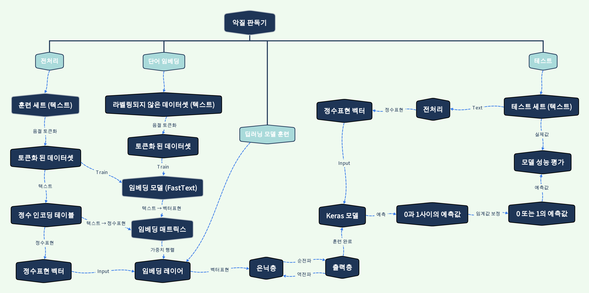

# ft_classifier
- FastText를 활용한 딥러닝 분류기입니다.

## data
### binary_classifier.ipynb
- 2runo/Curse-detection-data
    - https://github.com/2runo/Curse-detection-data

### multi_label_classifier.ipynb
- smilegate-ai/korean_unsmile_dataset
    - https://github.com/smilegate-ai/korean_unsmile_dataset
